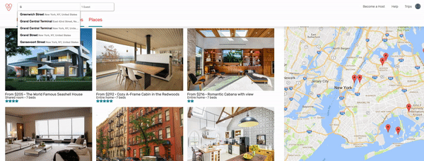

# NYCbnb

[LIVE][heroku]

[heroku]: http://nyc-bnb.herokuapp.com/#/

NYCbnb is a full-stack web application inspired by Airbnb. It utilizes Ruby on Rails on the backend, a PostgreSQL database, and React.js with a Redux architectural framework on the frontend.  

## Features & Implementation


### Google Maps Search

  In the backend, homes are stored in its own table that has the properties of but not limited to `lat`,`lng` and `address` which corresponds to the latitude, longitude and address of a particular location. The Google Places API allows for a dynamic map component to be used to display, upon search and also upon initial render, the homes that corresponds the bounds defined by the location; bounds refers to the longitude and latitude at the top-right and bottom-left corner of the map component.

  The map component was created with an idle event listener to trigger a re-render and update the slice of state that stores the current bounds. This in turn causes the homes within that bounds to be fetched and updated as markers on the map.

#### Screenshot
  

## User Reviews

  Stored in the database in addition to `homes` is the `bookings`, `reviews` and `users` table. Each user is is linked to a home in either through the `booking` joins table or through both the `booking` and `reviews` join table. Once the user has made a booking he/she now has a an association to retrieve all homes that was booked. When the user has that booking association a review can now be posted, deleted or edited by that user.

  The a review was constructed into its own component, `reviewItem`. Within this both the review body and the edit form was rendered. A conditional statement was set to determine if the review would be editable by the current user:

```javascript
  let editFormClass;
  let editButtonClass;
  let bodyClass;

  editButtonClass =  "hidden";
  editFormClass = "hidden";
  //editFormClass
  this.state.editFormOpen  ? ( editFormClass = "show-edit-form") : (editFormClass = "hidden")
  //editButtonClass
  if (this.props.currentUser){
    // if (this.props.currentUser.user.id === this.props.review.user.id) {
    if (this.props.currentUser.id === this.props.review.user.id) {
      editButtonClass =  "edit-buttons";
    }
  } else { editButtonClass =  "hidden"; }
  //bodyClass
  this.state.editFormOpen ? ( bodyClass = "hidden") : (bodyClass = "show-body")
  }
```

  Depending on the above conditional statements, a change in component state will be triggered causing the class name to be manipulated on a particular react element thus displaying or hiding accordingly


## Future Directions for the Project

To further develop what was already created the following implementations will be developed to improve user's experience.

### Search

The searching process currently utilizes Google Places API. I would like to make the searching process more specific to include filters such as guests, price ranges and room type.

### Hosting & Direct Messaging

The ability for a user to become a host is crucial to the actual Airbnb website. I would like the user to have the option to upload photos and be able to interact with the user
